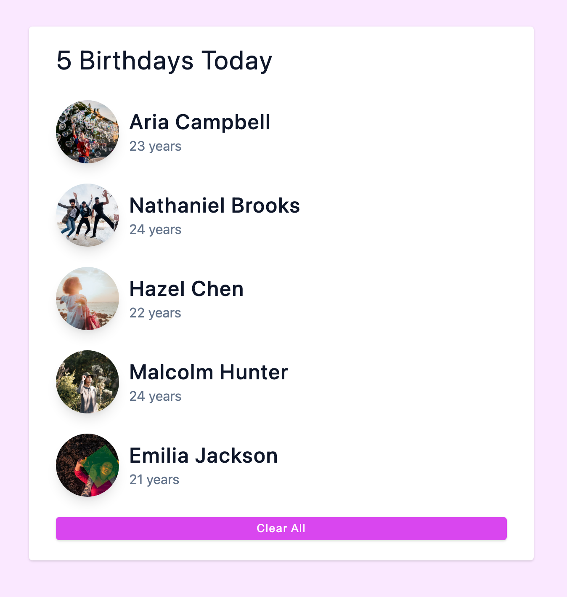

## CakeMates App

The `CakeMates` project is a React application that displays a list of people and their corresponding information. The project allows users to import data, set it up as a state variable, and render the list dynamically. Each person is represented with an image, name, and age. The application also includes a button to clear the list. The focus of this project is on functionality rather than styling, with a simple and straightforward user interface.

